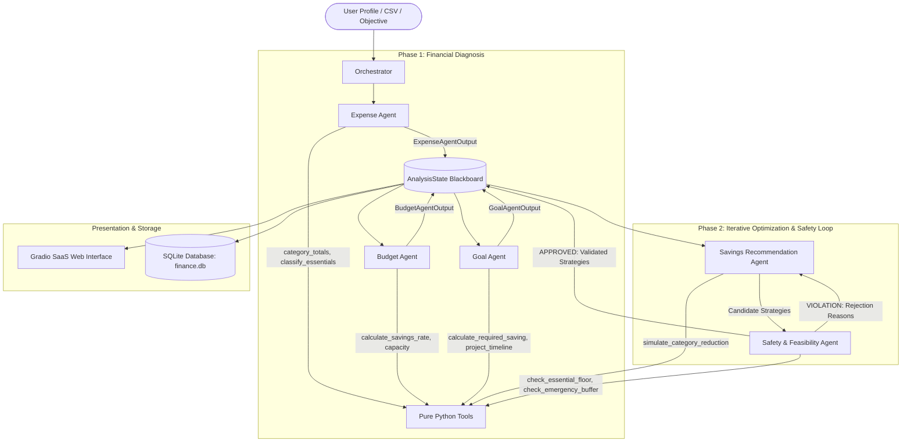

# Complete System Architecture & Technical Workflow

> **Multi-Agentic AI Personal Savings & Cash Flow Advisory System**  
> *A deterministic, safety-first personal finance platform powered by Groq LLMs, Neon PostgreSQL, specialized autonomous agents, and pure Python financial calculation tools.*

---

## 📑 Table of Contents
1. [Executive Overview](#1-executive-overview)
2. [Core Philosophy: Zero LLM Mental Arithmetic](#2-core-philosophy-zero-llm-mental-arithmetic)
3. [End-to-End System Architecture](#3-end-to-end-system-architecture)
4. [The Shared Blackboard State (`AnalysisState`)](#4-the-shared-blackboard-state-analysisstate)
5. [Specialized Agent Breakdown](#5-specialized-agent-breakdown)
   - [5.1 Orchestrator Agent](#51-orchestrator-agent)
   - [5.2 Expense Analysis Agent](#52-expense-analysis-agent)
   - [5.3 Budget Assessment Agent](#53-budget-assessment-agent)
   - [5.4 Goal Feasibility Agent](#54-goal-feasibility-agent)
   - [5.5 Savings Recommendation Agent](#55-savings-recommendation-agent)
   - [5.6 Safety & Feasibility Agent](#56-safety--feasibility-agent)
6. [The Reject → Revise → Approve Feedback Loop](#6-the-reject--revise--approve-feedback-loop)
7. [Deterministic Tool Layer (`tools/`)](#7-deterministic-tool-layer-tools)
8. [Persistence & Security Layer (`database.py`)](#8-persistence--security-layer-databasepy)
9. [User Interface & Interactive Features (`app.py`)](#9-user-interface--interactive-features-apppy)
10. [Step-by-Step Execution Lifecycle](#10-step-by-step-execution-lifecycle)
11. [Data Sources & User Archetypes](#11-data-sources--user-archetypes)
12. [Verification, Tests, & Failover](#12-verification-tests--failover)

---

## 1. Executive Overview

The **Multi-Agentic AI Personal Savings Recommendation System** is designed to eliminate the risks of hallucinations, math inaccuracies, and ungrounded financial advice inherent in standard conversational AI chatbots.

Instead of prompting a single large language model (LLM) to perform analysis, budgeting, goal tracking, and optimization in a single pass, this system deploys **6 specialized autonomous agents** acting in coordinated phases:
1. **Diagnosis Phase:** Deep analysis of historical spending, baseline requirements, and goal timelines.
2. **Optimization Phase:** Formulation of realistic, targeted expenditure cuts.
3. **Guardrail Phase:** Rigorous safety verification against subsistence floors, non-negotiable debt obligations, and behavioral sustainability bounds.

If a proposed recommendation violates a financial or behavioral safety rule, the system triggers a **closed-loop feedback cycle**: the Safety Agent rejects the proposal with explicit counter-instructions, forcing the Savings Agent to revise its strategy until every recommendation is mathematically sound and safe for real-world adoption.

---

## 2. Core Philosophy: Zero LLM Mental Arithmetic

Traditional generative AI models frequently suffer from calculation drift, compounding percentage errors, and hallucinated totals when handling personal finances. 

```
❌ TRADITIONAL LLM APPROACH:
User Input -> [Single Prompt LLM] -> Hallucinated Math & Unrealistic Cuts -> High Risk

✅ OUR MULTI-AGENTIC ARCHITECTURE:
User Input -> [Diagnostic Agents] -> [Python Calculation Tools] 
                                              |
                                     (Deterministic Math)
                                              v
           [Safety Agent Loop] <---> [Savings Agent] -> [Validated, Safe Plan]
```

### Key Principles Enforced:
- **No LLM Math:** The LLMs never perform arithmetic. Every rupee amount, percentage reduction, required savings velocity, and timeline metric is computed strictly by audited Python functions in the [`tools/`](tools/) directory.
- **Strict Separation of Concerns:** LLMs are utilized solely for qualitative synthesis, natural language understanding, and context-aware strategy framing.
- **Pydantic Validation:** All agent outputs are structured through typed Pydantic models.
- **Deterministic Offline Fallbacks:** If the Groq API is offline or unconfigured, the entire pipeline executes deterministically using embedded algorithmic rules without crashing.

---

## 3. End-to-End System Architecture

Below is the complete sequence and dataflow across all system layers:



---

## 4. The Shared Blackboard State (`AnalysisState`)

All agents communicate asynchronously over a centralized, typed blackboard data structure defined in [`state.py`](state.py):

```python
class AnalysisState(TypedDict):
    profile: dict               # Income, expense breakdown, goal amount, deadline, existing savings
    constraints: dict           # protect_essentials, target_extra_savings, focus_categories, strictness
    findings: dict              # {"expense": {...}, "budget": {...}, "goal": {...}}
    candidate_strategies: list  # Proposed plans generated by Savings Recommendation Agent
    validated_strategies: list  # Approved/adjusted plans certified by Safety Agent
    reasoning_log: list[str]     # Sequential audit log streamed in real time to UI
    status: str                 # "initialized", "expense_analyzed", "budget_analyzed", "revising", "safety_approved", "completed"
```

### Strict Pydantic Data Contracts
Each agent writes into `findings` using strictly typed Pydantic models:
- `ExpenseAgentOutput`: `category_totals`, `essential_total`, `discretionary_total`, `recurring_items`, `reasoning`.
- `BudgetAgentOutput`: `total_income`, `total_expenses`, `current_savings`, `savings_rate`, `discretionary_capacity`, `health_status`.
- `GoalAgentOutput`: `goal_amount`, `deadline_months`, `required_monthly_saving`, `gap_vs_current`, `is_feasible_with_current`, `projected_completion_months`.
- `StrategyItem`: `name`, `action`, `category`, `reduction_percent`, `estimated_monthly_saving`, `annual_impact`, `risk_level`, `status`.
- `SafetyAgentOutput`: `overall_approved`, `evaluations`, `rejection_reasons`, `reasoning`.

---

## 5. Specialized Agent Breakdown

### 5.1 Orchestrator Agent ([`agents/orchestrator.py`](agents/orchestrator.py))
- **Role:** Central mission coordinator and pipeline director.
- **Key Responsibilities:**
  1. **Natural Language Parsing:** Analyzes free-text user objectives (e.g., *"I want to cut dining out aggressively to buy a car in 10 months"*) into structured constraints:
     - `protect_essentials` (default: `True`)
     - `target_extra_savings` (float)
     - `focus_categories` (e.g., `["dining_out", "shopping"]`)
     - `strictness` (`"Conservative"`, `"Balanced"`, `"Aggressive"`)
  2. **Pipeline Sequencing:** Invokes Phase 1 agents sequentially (`Expense` → `Budget` → `Goal`).
  3. **Loop Management:** Mediates between `Savings Recommendation Agent` and `Safety Agent` for up to `max_revisions` iterations.
  4. **Live Generator Streaming:** Built as a Python generator (`run_pipeline_generator`), yielding incremental state updates to the web interface as each agent finishes its turn.

---

### 5.2 Expense Analysis Agent ([`agents/expense_agent.py`](agents/expense_agent.py))
- **Role:** Deep forensic breakdown of raw spending and historical transactions.
- **Assigned Tools:**
  - `category_totals()`: Calculates aggregated expenditures across all spending lines.
  - `classify_essential_vs_discretionary()`: Categorizes expenses into:
    - **Essential:** Rent/Mortgage, Groceries, Utilities, Debt EMI/Loans, Insurance, Healthcare.
    - **Discretionary:** Dining out, Food delivery, Shopping, Entertainment, Subscriptions, Travel.
  - `detect_recurring_expenses()`: Flags repetitive recurring charges across months.
- **Output:** Categorized expenditure breakdown and discretionary leak points stored in `state["findings"]["expense"]`.

---

### 5.3 Budget Assessment Agent ([`agents/budget_agent.py`](agents/budget_agent.py))
- **Role:** Evaluates baseline cash flow health and defines realistic optimization margins.
- **Assigned Tools:**
  - `calculate_savings_rate()`: Computes net monthly savings (`income - expenses`) and percentage savings rate (`savings / income * 100`). Assigns a financial rating (`Healthy` >= 30%, `Moderate` 15-30%, `Strained` < 15%, or `Deficit` < 0%).
  - `calculate_discretionary_capacity()`: Computes the maximum safe reduction ceiling from flexible spending (by default capped at 50% for sustainable plans; cuts beyond 65% trigger lifestyle fatigue).
- **Output:** Stored in `state["findings"]["budget"]`.

---

### 5.4 Goal Feasibility Agent ([`agents/goal_agent.py`](agents/goal_agent.py))
- **Role:** Benchmarks current savings trajectory against target financial milestones.
- **Assigned Tools:**
  - `calculate_required_monthly_saving()`: Calculates net savings required to reach the target amount within deadline:
    $$\text{Net Target} = \max(0, \text{Goal Amount} - \text{Existing Savings})$$
    $$\text{Required Monthly Saving} = \frac{\text{Net Target}}{\text{Deadline Months}}$$
    $$\text{Monthly Gap} = \text{Required Monthly Saving} - \text{Current Monthly Saving}$$
  - `project_completion_date()`: Computes the realistic timeline to achieve the goal at the current rate without changes.
- **Output:** Informs the savings agent exactly how much extra monthly capital must be freed up. Stored in `state["findings"]["goal"]`.

---

### 5.5 Savings Recommendation Agent ([`agents/savings_agent.py`](agents/savings_agent.py))
- **Role:** Proposes concrete, actionable spending cuts to bridge the financial gap.
- **Assigned Tools:**
  - `simulate_category_reduction()`: Simulates cutting an explicit percentage from a target category and yields monthly and annual savings.
  - `combine_strategies()`: Aggregates multiple category cuts into a composite optimization strategy.
- **Behavioral Loop Awareness:**
  - Reads `state["constraints"]["rejection_reasons"]`.
  - If a prior plan was rejected by the Safety Agent, the prompt injects the exact safety feedback, forcing the agent to lower cut ratios, switch categories, or honor essential floors.
- **Output:** Stored in `state["candidate_strategies"]`.

---

### 5.6 Safety & Feasibility Agent ([`agents/safety_agent.py`](agents/safety_agent.py))
- **Role:** The independent auditor and guardrail enforcer. Protects the user from unrealistic, hazardous, or illegal plans.
- **Assigned Tools:**
  - `check_essential_floor()`: Evaluates every strategy against:
    1. **100% Non-Negotiables:** Rejects cuts to rent, mortgage, loan payments, debt EMIs, and core insurance.
    2. **Subsistence Floors:** Protects base groceries (floor: ₹3,000/mo, max 25% cut) and utility services (floor: ₹1,000/mo, max 30% cut).
    3. **Discretionary Spending Ceiling:** Rejects total cuts exceeding 65% of discretionary spending.
    4. **Extreme Single-Category Cuts:** Rejects any single cut >= 75% due to high likelihood of behavioral burnout and relapse.
  - `check_emergency_buffer()`: Verifies that liquid reserves cover at least 3 months of baseline essential living expenses.
- **Output:** Stored in `state["validated_strategies"]`. If violations occur, marks `overall_approved = False` and sets `status = "safety_rejected"`.

---

## 6. The Reject → Revise → Approve Feedback Loop

The core innovation of this project is its closed-loop iterative dialogue between the **Savings Agent** and the **Safety Agent**:

```
 ┌────────────────────────────────────────────────────────┐
 │ 1. Savings Agent generates Candidate Strategies        │
 │    (e.g., Attempt 1: Cuts Rent by 25% or Dining by 80%)│
 └──────────────────────────┬─────────────────────────────┘
                            │
                            ▼
 ┌────────────────────────────────────────────────────────┐
 │ 2. Safety Agent evaluates each Strategy                │
 │    via pure Python check_essential_floor()             │
 └──────────────────────────┬─────────────────────────────┘
                            │
             ┌──────────────┴──────────────┐
       [Violations Found]            [All Clean]
             │                             │
             ▼                             ▼
 ┌──────────────────────────┐    ┌────────────────────────┐
 │ Reject & Extract Reasons │    │ Approve Strategies     │
 │ "Rent is non-negotiable; │    │ Status: safety_approved│
 │ Dining cut exceeds 75%"  │    └────────────┬───────────┘
 └───────────┬──────────────┘                 │
             │                                │
             ▼                                │
 ┌──────────────────────────┐                 │
 │ Inject feedback into     │                 │
 │ constraints blackboard   │                 │
 └───────────┬──────────────┘                 │
             │                                │
             ▼                                │
 ┌──────────────────────────┐                 │
 │ Savings Agent Revises:   │                 │
 │ (Attempt 2: Zero rent cut│                 │
 │  Dining cut reduced 40%) │                 │
 └───────────┬──────────────┘                 │
             │                                │
             └───────────────►────────────────┘
                                      │
                                      ▼
                        ┌───────────────────────────┐
                        │ Orchestrator Compiles     │
                        │ Final Verified Advice     │
                        └───────────────────────────┘
```

### Live Demo Scenario: Amit Patel
In the built-in demo scenario (*Amit Patel*), the system deliberately tests this loop:
1. **Pass 1:** An aggressive saving target triggers a proposed rent cut or high grocery cut.
2. **Safety Intervention:** The Safety Agent intercepts the violation:
   > *"Safety Agent Rejected [Cut Rent]: Rent and mortgage obligations are strictly protected and cannot be reduced."*
3. **Pass 2 (Re-generation):** The Savings Agent reads this exact violation from `state["constraints"]["rejection_reasons"]`, redirects cuts exclusively to dining out, shopping, and entertainment subscriptions, and achieves unanimous safety approval.

---

## 7. Deterministic Tool Layer (`tools/`)

Every tool is an independent, pure Python module without LLM dependencies:

| Tool File | Function Name | Purpose | Output |
| :--- | :--- | :--- | :--- |
| [`tools/expense_tools.py`](tools/expense_tools.py) | `category_totals` | Computes spending per bucket | `Dict[category, amount]` |
| [`tools/expense_tools.py`](tools/expense_tools.py) | `classify_essential_vs_discretionary` | Separates needs from wants | Essential vs discretionary totals |
| [`tools/expense_tools.py`](tools/expense_tools.py) | `detect_recurring_expenses` | Finds recurring subscription charges | List of recurring items |
| [`tools/budget_tools.py`](tools/budget_tools.py) | `calculate_savings_rate` | Computes current savings & health | `savings_rate_percent`, `status` |
| [`tools/budget_tools.py`](tools/budget_tools.py) | `calculate_discretionary_capacity` | Determines safe cut margin | `safe_to_cut_capacity` (50%), aggressive (75%) |
| [`tools/goal_tools.py`](tools/goal_tools.py) | `calculate_required_monthly_saving` | Net target and required monthly pace | `required_monthly_saving`, `gap_vs_current` |
| [`tools/goal_tools.py`](tools/goal_tools.py) | `project_completion_date` | Predicts completion timeline | `months_needed`, `projected_timeline_str` |
| [`tools/savings_tools.py`](tools/savings_tools.py) | `simulate_category_reduction` | Simulates category haircut | `monthly_saving`, `annual_saving`, `new_amount` |
| [`tools/savings_tools.py`](tools/savings_tools.py) | `combine_strategies` | Compiles composite strategy | Consolidated monthly & yearly totals |
| [`tools/safety_tools.py`](tools/safety_tools.py) | `check_essential_floor` | Validates floors, debts & limits | `is_safe`, `decision`, `violation_type`, `reason` |
| [`tools/safety_tools.py`](tools/safety_tools.py) | `check_emergency_buffer` | Tests for 3-month expense cushion | `current_buffer_months`, `buffer_deficit` |

---

## 8. Persistence & Security Layer (`database.py`)

The application incorporates a production-ready SQLite persistence layer located at [`data/finance.db`](data/finance.db):

### Database Schema
1. **`users` Table:**
   - `id`: Primary key.
   - `email`: Unique identifier.
   - `password_hash` & `salt`: Salted password credentials hashed using **PBKDF2-HMAC-SHA256** (100,000 rounds).
   - `full_name`, `created_at`.
2. **`financial_profiles` Table:**
   - Stores per-user financial baselines: income, rent, groceries, utilities, debt EMI, transport, dining out, shopping, entertainment, subscriptions, current savings, target goal, and deadline.
   - Tied via `FOREIGN KEY (user_id) REFERENCES users(id) ON DELETE CASCADE`.
3. **`saved_plans` Table:**
   - Stores user-activated recommendations: `title`, `goal_amount`, `required_monthly_saving`, `deadline_months`, `total_monthly_cut`, `strategies_json`, and `status`.
4. **`scenario_history` Table:**
   - Logs interactive *What-If* sandbox simulations: slider values for dining cuts, shopping cuts, subscription cuts, income shifts, and projected timelines.

---

## 9. User Interface & Interactive Features (`app.py`)

The web application is built on **Gradio Blocks** styled with a bespoke fintech design system (slate ink, warm gold, off-white card surfaces, and crisp status badges):

### Five Core User Workspaces:
1. **Workspace 1: Financial Setup & Presets**
   - ⚡ Quick-load curated personas:
     - **Rahul Verma:** Balanced corporate employee (moderate savings).
     - **Priya Sharma:** High-income professional with aggressive wealth goals.
     - **Amit Patel:** Strained budget with tight debt obligations (triggers demo reject/revise cycle).
   - CSV data uploader supporting customized monthly bank exports.
   - Free-text goal objective input.
2. **Workspace 2: Live Activity Feed & Multi-Agent Execution**
   - Real-time streaming log of every agent's thought process, tool calls, and floor checks.
   - Visual progress indicators and immediate notifications when a rejection occurs.
3. **Workspace 3: Visual Financial Dashboard**
   - **Expense Breakdown Chart:** Clean horizontal bar chart showing spending distribution (Essential vs Flexible).
   - **Goal Velocity Gauge:** Comparative bar chart contrasting current monthly savings against required savings pace.
   - High-level KPI stat cards (Savings Rate %, Discretionary Capacity, Current Gap).
4. **Workspace 4: Validated Recommendations & Action Plans**
   - Card deck of certified strategies detailing:
     - Specific Action Description.
     - Exact Monthly & Annual Savings (₹).
     - Risk Rating (`Low`, `Moderate`, `High`).
     - Safety Approval Stamp & Explanation.
   - One-click button to **Save & Activate Plan** to the user's permanent SQLite profile.
5. **Workspace 5: Interactive "What-If" Simulation Sandbox**
   - Dynamic real-time sliders allowing users to experiment with manual haircuts (e.g., dining out -30%, shopping -20%).
   - Instant re-projection of goal achievement date and annual savings.

---

## 10. Step-by-Step Execution Lifecycle

When the user clicks **Run Multi-Agent Analysis Pipeline**, the following sequence executes:

```
Step 01: [User Click] -> Gradio triggers run_pipeline_generator()
Step 02: [Orchestrator] -> Parses free-text objective using Groq/fallback heuristics into constraints dict
Step 03: [Orchestrator] -> Initializes AnalysisState blackboard (status: "initialized")
Step 04: [Expense Agent] -> Reads profile, calls category_totals() and classify_essential_vs_discretionary()
Step 05: [Expense Agent] -> Writes ExpenseAgentOutput to state["findings"]["expense"]
Step 06: [Budget Agent] -> Calls calculate_savings_rate() and calculate_discretionary_capacity()
Step 07: [Budget Agent] -> Writes BudgetAgentOutput to state["findings"]["budget"]
Step 08: [Goal Agent] -> Calls calculate_required_monthly_saving() and project_completion_date()
Step 09: [Goal Agent] -> Writes GoalAgentOutput to state["findings"]["goal"]
Step 10: [Savings Agent (Attempt 1)] -> Calls simulate_category_reduction() & combine_strategies()
Step 11: [Savings Agent] -> Generates candidate strategies in state["candidate_strategies"]
Step 12: [Safety Agent (Attempt 1)] -> Evaluates strategies with check_essential_floor()
Step 13: [Safety Decision]:
           - IF violation detected: Logs rejection reason, updates constraints["rejection_reasons"],
             and triggers Revision Attempt 2.
           - IF safe: Marks overall_approved = True, copies strategies to state["validated_strategies"].
Step 14: [Savings Agent (Attempt 2 - If needed)] -> Re-plans using feedback, avoids violations.
Step 15: [Safety Agent (Attempt 2)] -> Approves revised safe strategies.
Step 16: [Orchestrator] -> Compiles total monthly savings and marks status = "completed".
Step 17: [UI Update] -> Stream terminates; charts, KPI cards, and strategy recommendations render on screen.
```

---

## 11. Data Sources & User Archetypes

1. **Synthetic Multi-Month Generator (`data/generate_sample_data.py`):**
   - Generates 6 months of continuous expense records for 6 distinct user archetypes.
   - Exports directly to `data/sample_data.csv`.
2. **Kaggle Financial Dataset (`dataset/personal_finance_tracker_dataset.csv`):**
   - Pre-loaded benchmark dataset providing real-world spending variations across 1,000+ entries.
3. **Built-in Quick Personas:**
   - **Rahul Verma:** ₹75,000 income, ₹22,000 rent, moderate flexible spending.
   - **Priya Sharma:** ₹1,20,000 income, aggressive ₹5,00,000 goal in 12 months.
   - **Amit Patel:** ₹55,000 income, ₹15,000 EMI, heavy debt burden.

---

## 12. Verification, Tests, & Failover

### Automated Test Suites
The system includes three comprehensive verification test suites:
1. **Unit Tool Tests (`test_phase1_tools.py`):** Validates mathematical formulas, subsistence floor triggers, and edge cases across every tool function.
2. **Database & Security Tests (`test_database.py`):** Tests PBKDF2 password hashing, salt uniqueness, foreign key cascades, and profile updates.
3. **End-to-End Pipeline Tests (`test_pipeline.py`):** Simulates the entire multi-agent orchestration, verifying that the Reject → Revise → Approve loop executes properly.

### Resilient LLM Provider & Failover
In [`agents/base_agent.py`](agents/base_agent.py), the `invoke_llm_structured` function implements:
- Groq LLM integration with automatic model failover (`openai/gpt-oss-20b`, `openai/gpt-oss-120b`, `groq/compound-mini`, `qwen/qwen3.8-27b`).
- Schema-constrained JSON generation validated against Pydantic models.
- Graceful deterministic fallback: if internet access is interrupted or no API key is supplied, the agents fall back to verified heuristic rules without throwing unhandled exceptions.

---

*Document compiled for the Personal Savings Recommendation AI project. All references and code paths correspond to the active workspace.*
